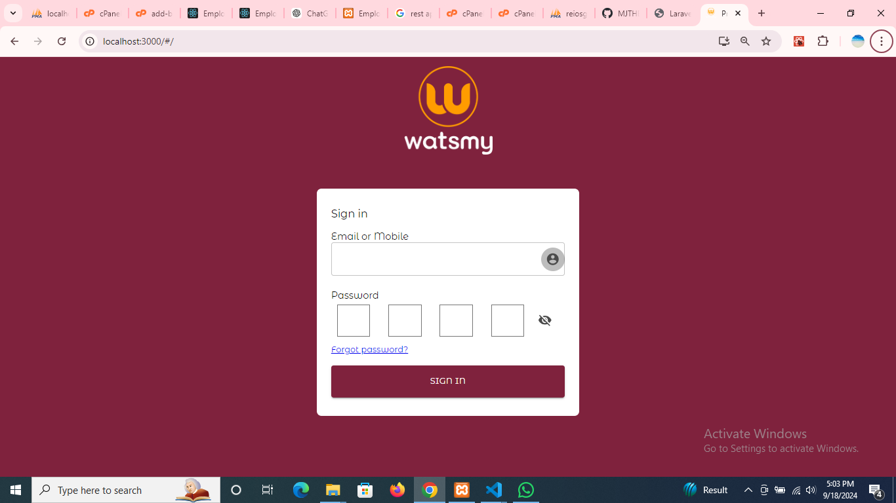
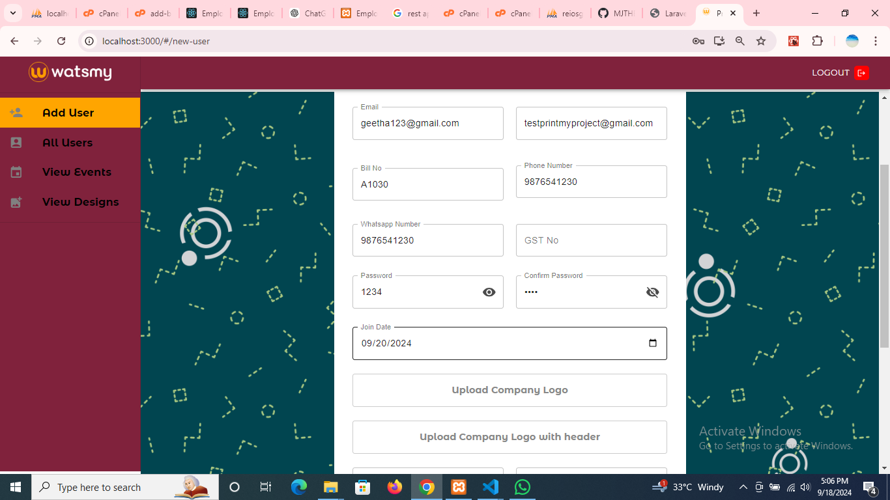
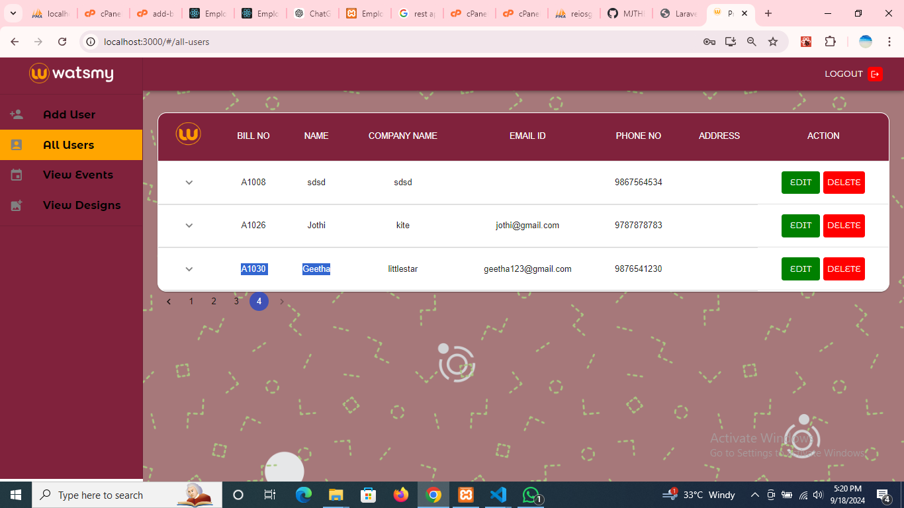
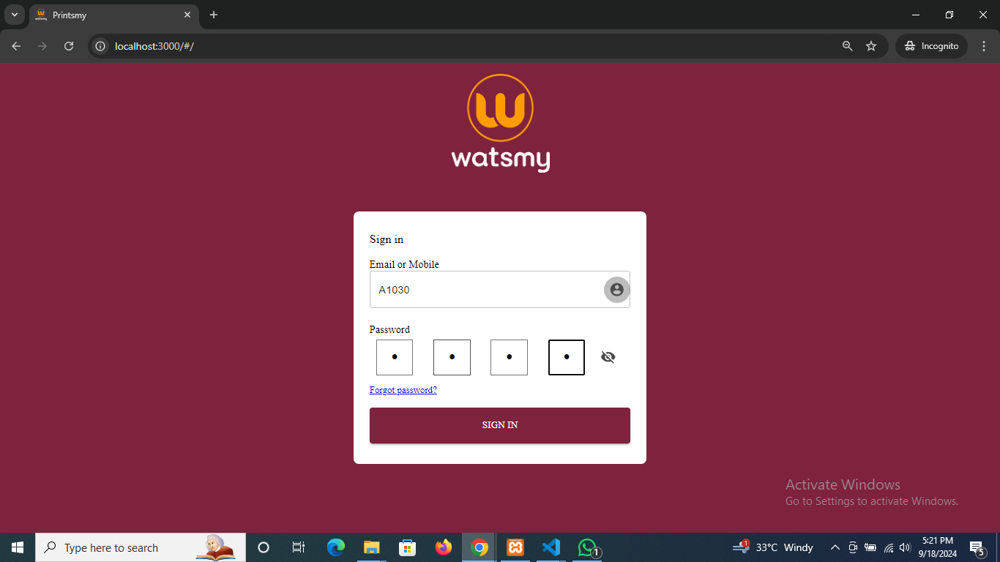
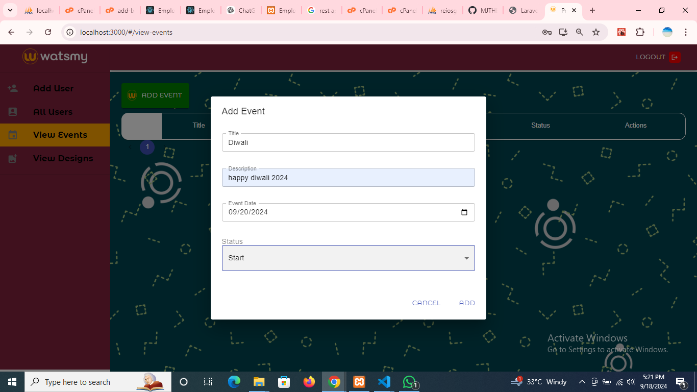

This Code Run for Localhost
  1) Download the OR git Pull https://github.com/MJTHENU/Printsmy_Frontend.git
  2) env cp env.example
  3) local set database import
  4) env DB Session check it
  5) npm Start
Outputs:

Same Code Server
  1) Download the OR git Pull https://github.com/MJTHENU/Printsmy_Frontend.git
  2) env cp env.example
  3) local set database import
  4) env DB Session check it
  5) npm Start
Build to Local for server
  1) npm run build
  2) cd ./build
  3) npm install -g serve
  4) npm install -g http-serve
  5) npx http-serve ./build
To Reassign the Port
  1)npx http-serve ./build -p 8081
Build server
1)public -->index.php & httaccess file chage it 2) at the same time move to public-->main/outside

